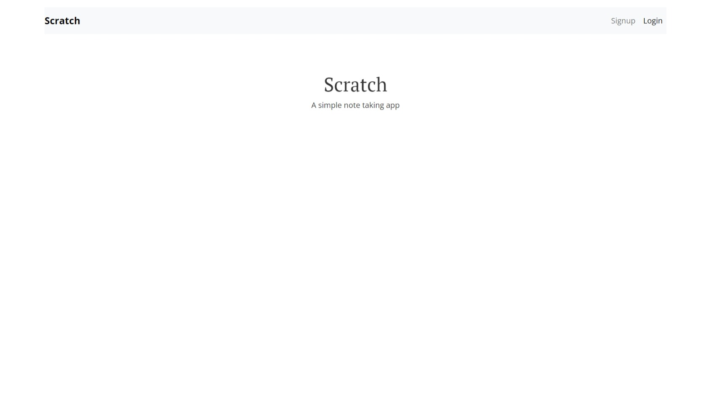
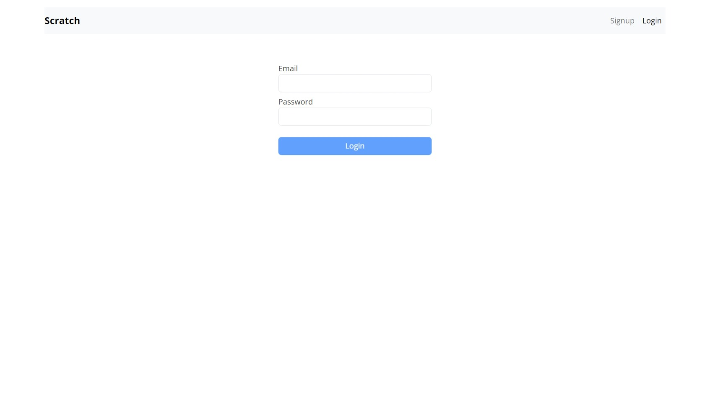
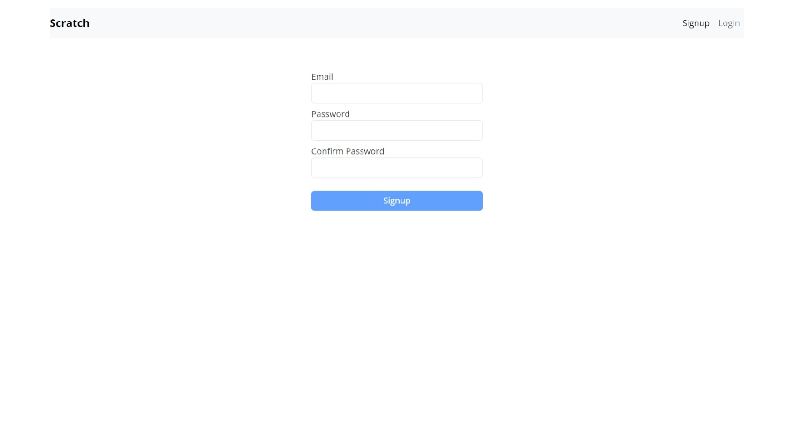
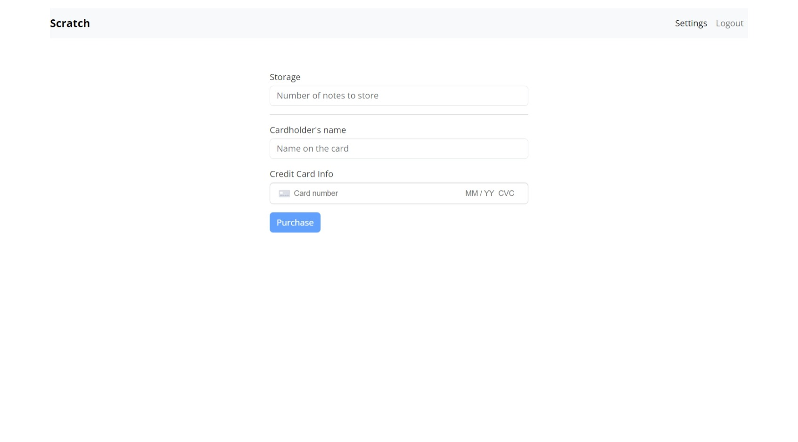
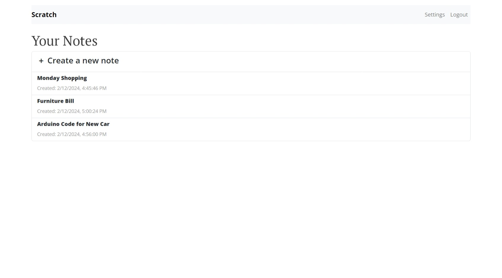
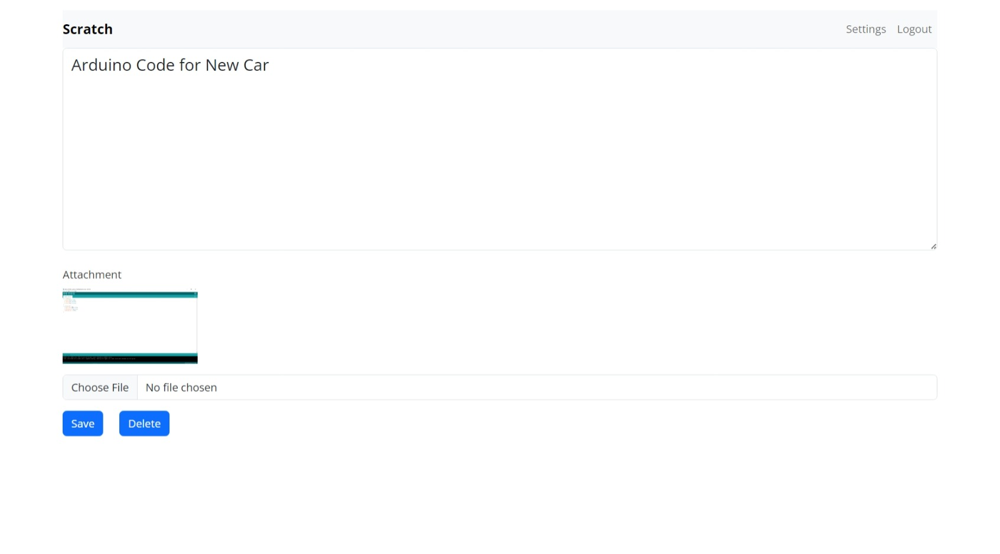

# Serverless Scratch Frontend 🚀

Welcome to the Serverless Scratch Frontend repository for our amazing note-taking app, Scratch! 📝✨

This repository contains the React.js single page application that powers Scratch. It's seamlessly integrated with our serverless API, providing a smooth and responsive experience for users. Followed the [Serverless Stack Tutorial](https://branchv41--serverless-stack.netlify.app) to build a secure, functional, and responsive web app.

## Preview

  
&nbsp; &nbsp; &nbsp; &nbsp;
  

  
&nbsp; &nbsp; &nbsp; &nbsp;
  

  
&nbsp; &nbsp; &nbsp; &nbsp;
  

## Getting Started

To check out the fully functional app hosted on GitHub Pages, visit [Serverless Scratch on GitHub Pages](https://banulalakwindu.github.io/serverless-stack-client/) 🌐.

### Backend Integration

Our frontend is intricately connected to the backend, which is hosted separately. The backend repository contains the serverless API code and other backend-related functionalities. To explore the backend, visit [Serverless Scratch Backend](https://github.com/banulalakwindu/serverless-stack-api).

### Serverless Architecture

Embracing the serverless paradigm, our app leverages AWS Lambda & API Gateway for the serverless API, DynamoDB for the database, and Cognito for user authentication. This ensures scalability, security, and cost-effectiveness. 🌐🔒💰

## Technologies Used

- React.js
- React Router
- Bootstrap
- GitHub Pages
- AWS Lambda & API Gateway
- DynamoDB
- Cognito
- S3
- CloudFront
- Route 53
- Certificate Manager
- CloudWatch
- Stripe

## How to Contribute

We welcome contributions! Feel free to fork the repository, make your changes, and submit a pull request. Let's build Scratch together! 🤝🚀

Happy Coding! 🎉
